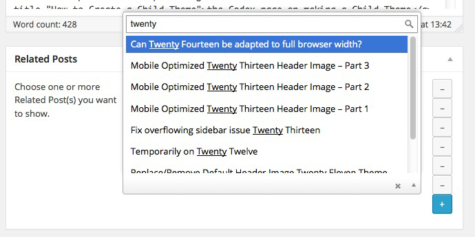
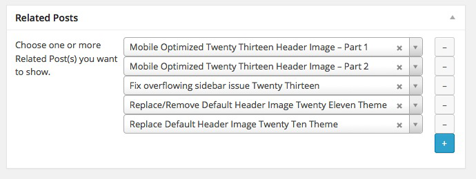
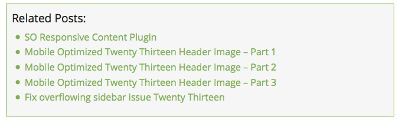
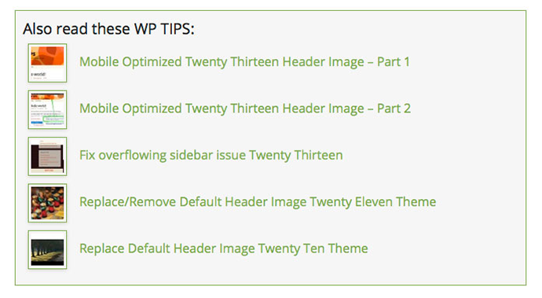

# SO Related Posts

###### Last updated on 2015.06.19
###### requires at least WordPress 4.0
###### tested up to WordPress 4.3-alpha
###### Author: [Piet Bos](https://github.com/senlin)
###### [Stable Version](http://wordpress.org/plugins/so-related-posts) (via WordPress Plugins Repository)
###### [Plugin homepage](http://so-wp.com/?p=63)

##### [SO Related Posts PLUS](https://senlinonline.com/plus/plugin/so-related-posts-plus/)

The SO Related Posts plugin puts you in control on what really is related content.

## Description

The SO Related Posts plugin is an Extension for the fantastic [Meta Box plugin](https://github.com/rilwis/meta-box) and puts you in control on what really is related content. 

With the plugin installed you will find a Related Posts box underneath the Post Editor. Here you will see a checkbox which you can use to turn showing the Related Posts on or off as well as a neat dropdown menu that shows up to 999 of your published Posts.

On the frontend the Related Posts are shown in their own class with an unordered list, right after `the_content()`. The class will use the styling of your theme and you can style it further to your own liking. 

Since v1.1.0 (2014.01.20) I added a method to install the Meta Box plugin (where this extension depends on), instantly from within your website.

Since v1.3.0 (2014.02.12) I have added a Settings Page where you can change the default title "Related Posts" into something of your liking.

Since v1.3.2 (2014.03.23) I have added a checkbox with which you can turn the Related Posts on or off per Post

Since v1.3.4 (2014.04.04) there is a premium version available with more built in options, such as custom styling from within the plugin and the possibility to add thumbnails. More information via [SO PLUS](https://senlinonline.com/plus/plugin/so-related-posts-plus/).

### Background

For a while already I have been breeding on how to make a Related Posts plugin that doesn't query the database n times looking for related posts by tags, categories or what not. Most of the existing Related Posts plugin have an incredible (negative) impact on your site speed, so the benefits don't outweigh the costs.

Instead I was thinking that it would be much more flexible too if the user can choose his/her own Related Posts from a simple Posts drop down menu.

Among heaps of other very useful fields, the [Meta Box plugin](http://metabox.io) comes  with both a Post field and a Repeater field. I have combined these two and made it so that you can now show as many Related Posts as you want underneath the current Post. 

The SO Related Posts metabox uses the [Select2](http://ivaynberg.github.io/select2/) script which results in really beautiful and functional drop down menus. Credits for this functionality must all go to Rilwis as this is already baked in the Meta Box plugin.

On the Settings Page you can change the title that shows on the front end above the list of Related Posts.

## Frequently Asked Questions

### Can I change the default title?

Yes, since v1.3.0 (2014.02.12) I have added a Settings Page where you can change the title that shows on the front end above the list of Related Posts. More options are available with the [SO Related Posts PLUS](https://senlinonline.com/plus/plugin/so-related-posts-plus/) plugin.

### I have not added any Related Posts, but the plugin shows the current post as Related Posts

First update to the latest version. If after updating it still shows, then you need to uncheck the checkbox that shows under your Post.

### Why is the plugin showing an error message after activation?

This plugin is an Extension for the [Meta Box plugin](http://metabox.io). If you don't have that installed, this Extension is useless. If you click on the link that shows with the error message you will go to a new page "Required Plugin" to install the Meta Box plugin.

### I don't like the output on my Single Post, can I change anything?

Yes, you can. The output comes in its own class (`so-related-posts`) and in it you will find an `h4` for the title and an unordered list which has a class of `related-posts`. In your theme's `style.css` you can add any styling as you please.

### I have an issue with this plugin, where can I get support?

Please open an issue here on [Github](https://github.com/senlin/so-related-posts/issues)

## Contributions

This repo is open to _any_ kind of contributions.

## License

* License: GNU Version 2 or Any Later Version
* License URI: http://www.gnu.org/licenses/gpl-2.0.html

## Donations

* Donate link: http://so-wp.com/donations

## Connect with me through

[Github](https://github.com/senlin) 

[WordPress](http://profiles.wordpress.org/senlin/) 

[Website](http://senlinonline.com)

## Changelog

### 1.4.1

* date: 2015.06.19
* revert to [semantic versioning](http://semver.org/)
* modify metabox registration replace deprecated `pages` with `post_types`

### 1.4.0

* date: 2015.06.17
* added new MetaBox feature of sort_clone 

### 1.3.1

* date: 2015.04.23
* update TGM Plugin Activation class to 2.4.1 which fixes reported [XSS vulnerability](http://wptavern.com/xss-vulnerability-what-to-do-if-you-buy-or-sell-items-on-themeforest-and-codecanyon) 

### 1.3.10

* date: 2015.04.09
* changed logos

### 1.3.9

* date: 2015.03.16
* tested up to WP 4.2
* bumped minimum required version up to WP 4.0

### 1.3.8

* date: 2014.08.15
* remove function that disables auto-activation of Jetpack's related posts module -> doesn't work, stop trying, waste of time

### 1.3.7

* date: 2014.07.27
* add wpml-config.xml file to be able to translate the title on sites that have WPML installed
* increase min. required WP version to 3.8

### 1.3.6

* date: 2014.04.17
* added filter to prevent Jetpack related posts module from auto-activating
* move minimum WP version up to 3.7
* modify default settings function

### 1.3.5

* date: 2014.04.09
* updated TGM Plugin Activation class to 2.4
* update language files

### 1.3.4

* date: 2014.04.04
* added SO PLUS reference and discount coupon
* update language files

### 1.3.3

* date: 2014.04.03
* fix title bug

### 1.3.2

* date: 2014.03.23
* add checkbox to turn Related Posts on/off per post without losing the Posts you already have set. (default = off)

### 1.3.1

* date: 2014.02.20
* bugfix, set default output title if no title has been filled in

### 1.3.0

* date: 2014.02.12
* add settings page to enable changing the title output on the front end
* update language files
* update SO WP icon

### 1.2.0

* date: 2014.02.09
* change priority from 1 to 5 to improve so_related_posts_output content filter
* add conditional is_main_query()
* unset foreach call
* security fix: escape text/url/title-strings

### 1.1.1

* date: 2014.01.24
* add Dutch language files (.po/.mo)
* add .pot file

### 1.1.0

* date: 2014.01.20
* integrated TGM Plugin Activation class by Thomas Griffin - https://github.com/thomasgriffin/TGM-Plugin-Activation

### 1.0.1

* date: 2014.01.07
* added "Please select..." placeholder text

### 1.0.0

* date: 2014.01.06
* first release

## Screenshots

Preview of the meta box in the backend and the output on the front end.

---

---

---

